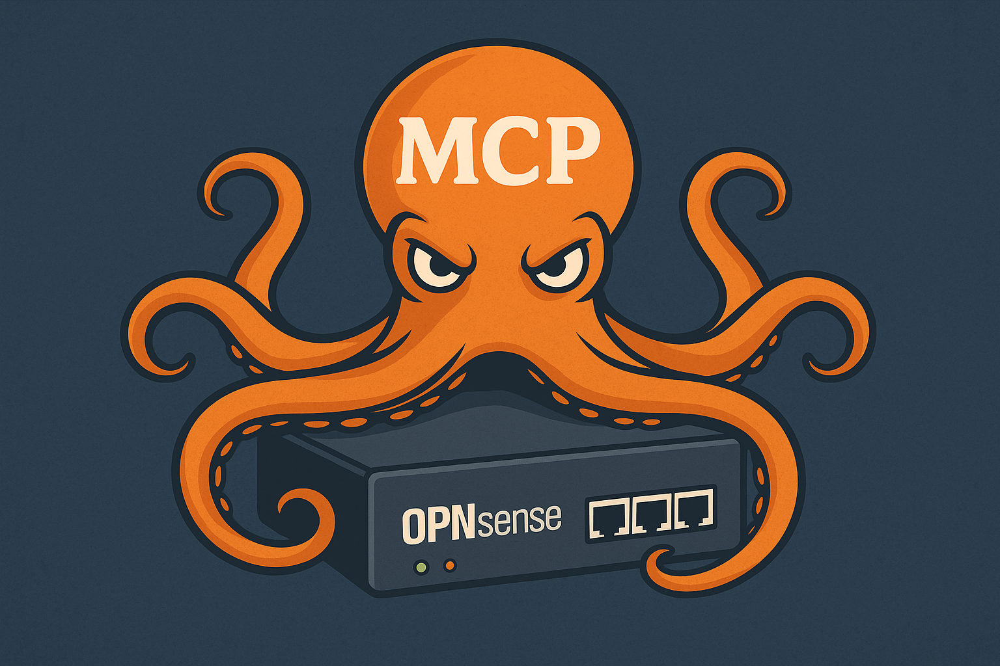

<p align="center">
  
</p>

# OPNsense MCP Server

OPNsense® is a powerful open-source firewall and routing platform built on FreeBSD. Managing OPNsense typically involves using its web interface or interacting directly with its comprehensive API. This project offers a way to manage your OPNsense firewall using natural language through AI clients like Claude Desktop. It does this by providing a Python server that implements Anthropic's Model Context Protocol (MCP), a standard allowing AI models to securely connect to and utilize external tools. This server listens for requests from MCP clients, translates them into the appropriate OPNsense API calls, and returns the results.

## Features

- Full access to OPNsense API functionality
- Firewall rule management
- Network interface monitoring
- DHCP lease management 
- Firewall alias management
- System status and health monitoring
- Service management
- VPN connection monitoring
- Plugin management
- Custom API calls for any OPNsense endpoint
- **Basic Firewall Security Audit**

## Requirements

- Python 3.10 or higher
- OPNsense firewall with API access configured
- MCP-compatible client (e.g., Claude Desktop)

## Prerequisites

- `git` (for cloning the repository)
- `uv` for Python package management (see installation below).
- `jq` (command-line JSON processor) if you plan to use the `setup-claude.sh` script for automated Claude Desktop configuration.

## Installation

1. **Clone the Repository:**

   ```bash
   git clone https://github.com/floriangrousset/opnsense-mcp-server
   cd opnsense-mcp-server
   ```

2. **Install `uv` (if not already installed):**

   `uv` is a fast Python package installer and environment manager. Install it using the official instructions:
   
   ```bash
   # For macOS/Linux
   curl -LsSf https://astral.sh/uv/install.sh | sh
   
   # For Windows (PowerShell)
   curl -LsSf https://astral.sh/uv/install.ps1 | powershell -c -
   ```

3. **Create and Activate Virtual Environment:**

   It's highly recommended to use a virtual environment.

   ```bash
   # Create a virtual environment
   uv venv
   
   # Activate it (Linux/macOS)
   source .venv/bin/activate
   
   # Activate it (Windows)
   .venv\Scripts\activate
   ```

4. **Install Dependencies:**

   ```bash
   uv pip install -r requirements.txt
   ```

5. **Make Scripts Executable (Linux/macOS):**

   ```bash
   chmod +x opnsense_mcp_server.py
   chmod +x setup-claude.sh
   ```

## Setup OPNsense API Access

Before using this server, you need to create API credentials in your OPNsense firewall:

1. Log in to your OPNsense web interface
2. Navigate to **System** → **Access** → **Users**
3. Select the user you want to create API keys for (or create a new user)
4. Scroll down to the **API keys** section and click the **+** button
5. Download the API key file which contains your credentials

## Configuring Claude Desktop

To use this MCP server with Claude Desktop, you can either configure it manually or use the provided setup script.

**Method 1: Using the Setup Script (Recommended)**

1.  Ensure you have `jq` installed on your system. You can typically install it using your system's package manager (e.g., `apt install jq`, `yum install jq`, `brew install jq`).
2.  Make the script executable: `chmod +x setup-claude.sh`
3.  Run the script: `bash setup-claude.sh`
4.  The script will attempt to automatically find your Claude Desktop configuration file and add the necessary server entry.
5.  Restart Claude Desktop for the changes to take effect.

**Method 2: Manual Configuration**

1. Install [Claude Desktop](https://claude.ai/desktop) if you haven't already
2. Open Claude Desktop
3. Access the settings from the Claude menu
4. Go to the Developer tab
5. Click on "Edit Config"
6. Find the `mcpServers` section (or add it if it doesn't exist) and add the following entry:

```json
{
  "mcpServers": {
    "opnsense": {
      "command": "python",
      "args": [
        "/path/to/opnsense_mcp_server.py"
      ],
      "env": {}
    }
  }
}
```

Replace `/path/to/opnsense_mcp_server.py` with the **absolute path** to your `opnsense_mcp_server.py` script.

7. Save the config file and restart Claude Desktop

## Usage Examples

Once the MCP server is configured and running with Claude Desktop, you can interact with your OPNsense firewall using natural language. Here are some examples:

1. Configure the connection to your OPNsense firewall:

```
Configure my OPNsense firewall with the following information:
URL: https://192.168.1.1
API Key: your_api_key
API Secret: your_api_secret
```

2. Check the system status:

```
What's the current status of my OPNsense firewall?
```

3. Manage firewall rules:

```
List all firewall rules.
```

```
Add a new firewall rule to allow HTTP traffic from any source to my web server at 192.168.1.100.
```

```
Delete the firewall rule with UUID abc123def456.
```

4. Work with firewall aliases:

```
Show me all the firewall aliases.
```

```
Add IP address 10.0.0.5 to the alias named "BlockedIPs".
```

5. Monitor network interfaces:

```
Show me all network interfaces and their status.
```

6. View system health:

```
What's the current health status of my OPNsense system? Show CPU, memory, and disk usage.
```

7. Manage services:

```
Restart the DHCP service.
```

8. Examine VPN connections:

```
Show me all active OpenVPN connections.
```

9. Execute a custom API call:

```
Execute a GET request to the endpoint "/interfaces/overview/interfacesInfo".
```

10. Perform a basic security audit:

```
Perform a security audit of my OPNsense firewall configuration.
```

## Security Considerations

- Use a dedicated user with minimal required privileges for API access
- Use HTTPS for your OPNsense web interface
- Consider setting up a firewall rule to restrict API access to specific IP addresses
- Regularly audit API access logs

## Troubleshooting

If you encounter issues:

1. Check the OPNsense API credentials
2. Verify the firewall is accessible from your network
3. Ensure the API is enabled in OPNsense
4. Check the permissions of the API user
5. Look for any error messages in the Claude Desktop logs

## References and Acknowledgements

- **OPNsense®:** This project interacts with OPNsense firewalls. OPNsense is an open source, FreeBSD-based firewall and routing software. More information can be found on the [OPNsense Website](https://opnsense.org/) and their [API Documentation](https://docs.opnsense.org/development/how-tos/api.html).
    - [OPNsense Development Guidelines](https://docs.opnsense.org/development/guidelines/basics.html)
- **Anthropic & Model Context Protocol (MCP):** This server implements MCP to allow clients like Claude Desktop to interact with OPNsense. Learn more about how Claude uses tools via the [Anthropic Tool Use Documentation](https://docs.anthropic.com/claude/docs/tool-use).
- **Project Logo:** The logo `opnsense-mcp-server-logo.png` was generated with the assistance of AI.

## Contributing

Contributions are welcome! Please see the `CONTRIBUTING.md` file for guidelines on how to submit issues or pull requests.

## License

This project is licensed under the MIT License - see the LICENSE file for details.
